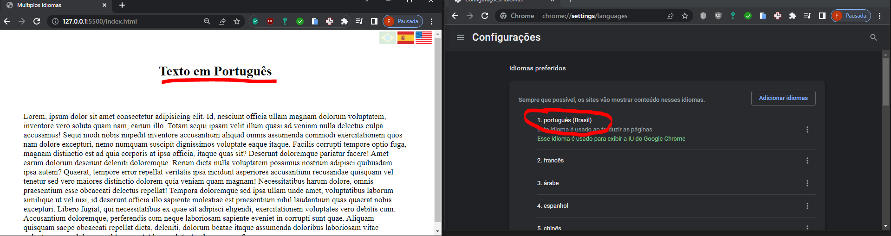
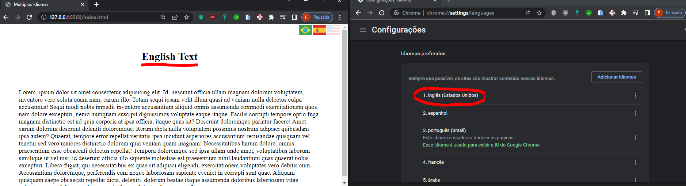
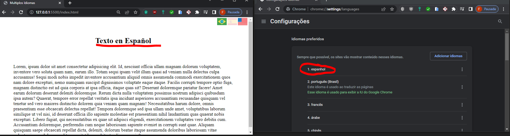
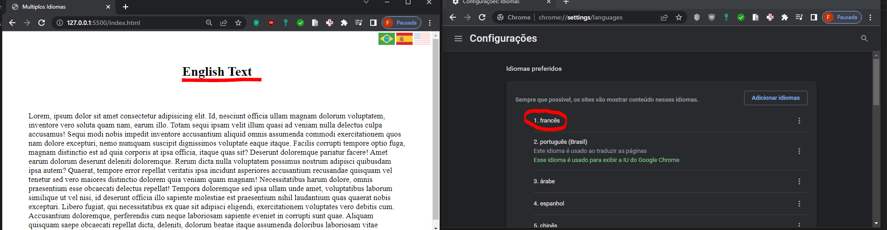

# Multiplo Idioma

Identifica automaticamente o idioma do navegador, e atribuir o conteudo de acordo com a lingua correspondente. Podendo também ser alterado manualmente ao clicar nas bandeiras.
Se o navegador estiver configurado em um idioma não compativél com o conteudo disponivel, é atribuido inglês como padrão

### Screenshot

**No exemplo Frances não é compativél e foi atribuido Inglês.
